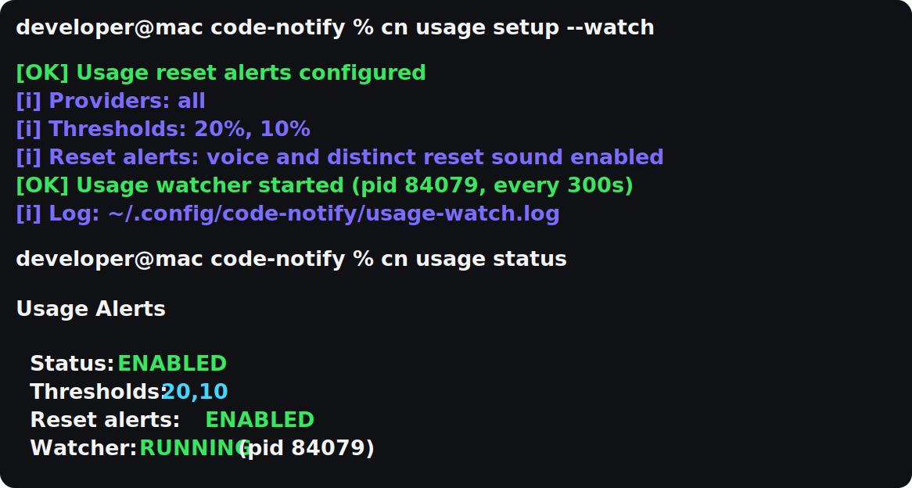

# Code-Notify

> **Official downloads**: https://github.com/xuyangy/code-notify/releases
>
> **Install**: `curl -sSL https://raw.githubusercontent.com/xuyangy/code-notify/main/scripts/install.sh | bash`

Desktop notifications for AI coding tools - get alerts when tasks complete or input is needed.

## Latest: Usage Limit Reset Alerts

Code-Notify can now watch Codex and Claude usage limits and tell you when tokens are back.

- **Daily reset**: `Codex token daily limit reset`
- **Weekly reset**: `Codex token weekly limit reset`
- **Low-usage warnings**: 20% and 10% remaining
- **Delivery options**: desktop notification, voice, sound, Slack, Discord, or ntfy phone push

Voice samples: [Daily reset](https://cdn.jsdelivr.net/gh/xuyangy/code-notify@main/assets/audio/codex-token-daily-limit-reset.m4a) · [Weekly reset](https://cdn.jsdelivr.net/gh/xuyangy/code-notify@main/assets/audio/codex-token-weekly-limit-reset.m4a)

```bash
cn usage setup --watch
cn usage status
```

`cn usage setup --watch` enables usage alerts, turns on distinct reset voice/sound, and starts a background watcher.



<p>
  
  
</p>

[](https://github.com/xuyangy/code-notify/releases)
[](https://opensource.org/licenses/MIT)
[](https://www.apple.com/macos)
[](https://www.linux.org/)
[](https://www.microsoft.com/windows)

---

## What's New in v1.10.0

- **One-command usage setup**: `cn usage setup --watch` configures Codex/Claude usage alerts and starts the background watcher
- **Background usage watcher**: macOS/Linux users can start, stop, restart, and inspect usage watching with `cn usage watch ...`
- **Usage alert docs**: README now shows the terminal setup flow and Slack/Discord reset alert routing

---

## Features

- **Multi-tool support** - Claude Code, OpenAI Codex, Google Gemini CLI, Google Antigravity CLI (`agy`)
- **Works everywhere** - Terminal, VSCode, Cursor, or any editor
- **Cross-platform** - macOS, Linux, Windows
- **Native notifications** - Uses system notification APIs
- **macOS click-through control** - Choose which app notification clicks activate
- **tmux click-to-focus** - Clicking a notification jumps to the exact tmux window/pane the tool runs in (macOS; uses [alerter](https://github.com/vjeantet/alerter) for persistent alerts when installed)
- **tmux window badges** - The originating tmux window's name gets the event icon prepended ("🎯 zsh"), so pending work is visible in the status line. For Claude the badge marks a window as waiting for you and stays until you actually give it more work (it clears on your next prompt in that window), so a glance at the output doesn't wipe it. For Codex/Antigravity — which have no prompt signal — it clears the moment you switch to the window (manually, by clicking the notification, or via terminal-notifier `-focusLast`). Renaming a badged window yourself keeps your name. Disable with `CODE_NOTIFY_TMUX_BADGE=false` or `touch ~/.claude/notifications/tmux-badge-disabled`
- **Sound notifications** - Play custom sounds on task completion
- **Voice announcements** - Hear when tasks complete (macOS, Windows)
- **ElevenLabs voices** - Optional high-quality cloud TTS for voice announcements (macOS)
- **Slack/Discord/ntfy delivery** - Mirror notifications to webhooks or your phone
- **Codex hook ownership** - Handles Codex completion and approval/edit requests through Codex hooks while disabling duplicate Codex TUI toasts
- **Usage alerts** - Opt-in Codex/Claude 20%, 10%, and reset notifications
- **Rotating tool-specific messages** - "Claude is idle", "Codex wrapped up", and other short variants are chosen randomly per event
- **Project-specific settings** - Different configs per project
- **Quick aliases** - `cn` and `cnp` for fast access

## Installation

### For Humans

**macOS / Linux / WSL**

```bash
curl -sSL https://raw.githubusercontent.com/xuyangy/code-notify/main/scripts/install.sh | bash
cn on
```

**Windows**

```powershell
irm https://raw.githubusercontent.com/xuyangy/code-notify/main/scripts/install-windows.ps1 | iex
```

**Update an existing install**

```bash
cn update
code-notify version
```

**Install a specific version (advanced)**

By default the installer pulls the latest `main`. Set `CODE_NOTIFY_REF` to install a
specific branch, tag, or commit SHA instead — useful for pinning a known-good
version or testing a branch:

```bash
# pin to a release tag
curl -sSL https://raw.githubusercontent.com/xuyangy/code-notify/main/scripts/install.sh | CODE_NOTIFY_REF=v1.10.0 bash

# or a branch / commit SHA
CODE_NOTIFY_REF=my-branch bash scripts/install.sh
```

Note: `CODE_NOTIFY_REF` selects the code that gets installed; the `install.sh` you pipe
to `bash` is always fetched from `main`. The ref is ignored when installing from a local
checkout (it copies your working tree).

If you were using the older `claude-notify` hook layout, supported upgrades now repair those Claude hooks automatically. On Windows, that repair also covers older `notify.ps1` hook layouts and alternate Claude settings locations such as `%USERPROFILE%\.config\.claude\settings.json`. Existing unrelated Claude hooks are preserved during enable/disable operations.

### For AI Coding Agents

Paste this to your AI coding agent (Claude Code, Codex, Cursor, Gemini CLI, etc.):

```
Install code-notify with the install script.

curl -sSL https://raw.githubusercontent.com/xuyangy/code-notify/main/scripts/install.sh | bash
cn on all
cn test
cn status
```

Expected result:

- `cn test` shows a desktop notification.
- `cn status` shows enabled tools.

See [docs/installation.md](docs/installation.md) for more details.

## Usage


| Command              | Description                                  |
| -------------------- | -------------------------------------------- |
| `cn on`              | Enable notifications for all detected tools  |
| `cn on all`          | Explicit alias for enabling all detected tools |
| `cn on claude`       | Enable for Claude Code only                  |
| `cn on codex`        | Enable Codex hooks and suppress duplicate Codex TUI toasts |
| `cn on gemini`       | Enable for Gemini CLI only                   |
| `cn on antigravity`  | Enable for Antigravity CLI (`agy`); `cn on agy` also works |
| `cn off`             | Disable notifications                        |
| `cn off all`         | Explicit alias for disabling all tools       |
| `cn test`            | Send test notification                       |
| `cn status`          | Show current status                          |
| `cn update`          | Update code-notify                           |
| `cn update check`    | Check the latest release and show the update command |
| `cn click-through`   | Show current macOS click-through mappings    |
| `cn click-through add <app>` | Add a macOS click-through mapping    |
| `cn alerts`          | Configure which events trigger notifications |
| `cn alerts persist`  | Keep selected alerts visible until closed    |
| `cn channels`        | Configure Slack/Discord/ntfy delivery        |
| `cn snooze <time>`   | Pause all notifications (30m, 2h, off)       |
| `cn usage`           | Configure Codex/Claude usage alerts          |
| `cn sound on`        | Enable sound notifications                   |
| `cn sound set <path>`| Use custom sound file                        |
| `cn voice on`        | Enable voice (macOS, Windows)                |
| `cn voice on claude` | Enable voice for Claude only                 |
| `cn voice engine elevenlabs` | Use ElevenLabs cloud voice (macOS)   |
| `cn voice elevenlabs key <key>` | Store your ElevenLabs API key     |
| `cnp on`             | Enable for current project only              |

When enabling project notifications with `cnp on`, Code-Notify warns if Claude project trust does not appear to be accepted yet.
Project-scoped Claude hooks override the global mute file, so `cn off` will not suppress a project where `cnp on` is enabled.
`all` is also accepted as an explicit alias for global commands such as `cn on all`, `cn off all`, and `cn status all`.

## How It Works

Code-Notify uses the hook systems built into AI coding tools:

- **Claude Code**: `~/.claude/settings.json`
- **Codex**: `~/.codex/hooks.json`
- **Gemini CLI**: `~/.gemini/settings.json`
- **Antigravity CLI (`agy`)**: imported plugin at `~/.claude/notifications/agy-plugin/` (registered with `agy plugin install`)

For Codex, Code-Notify configures `~/.codex/hooks.json` with Codex lifecycle hooks and disables Codex TUI notifications in `~/.codex/config.toml` to avoid duplicate toasts. The `Stop` hook sends task-complete notifications. When `permission_prompt` is enabled, Code-Notify also adds a `PermissionRequest` hook for approval/edit requests.

For Antigravity CLI, Code-Notify builds a small plugin and registers it with `agy plugin install`. Antigravity hooks receive their payload on stdin and pass no arguments, so each event runs a tiny wrapper that pipes the payload into the notifier. The mapping reflects what `agy` actually executes today (tested against `agy` 1.0.11):

- **Input needed** — a `PreToolUse` hook (scoped to `run_command`) fires while `agy` waits for you to approve a command. Registered only when the `permission_prompt` alert type is enabled.
- **Task complete** — `agy` has no working `Stop`/lifecycle hook yet, so completion is inferred by debouncing `PostToolUse`: once tool activity has been quiet for a few seconds (`CODE_NOTIFY_AGY_DEBOUNCE_SECONDS`, default 8), a single "task complete" notification fires. A native `Stop` hook is also installed and will take over automatically if a future `agy` build runs it.
- **Errors** — a failing `PostToolUse` (string or structured error) fires an immediate failure alert and cancels any pending "task complete" for that step.

Disable everything with `cn off antigravity`, which runs `agy plugin uninstall code-notify`.

For Claude Code, it adds hooks like:

```json
{
  "hooks": {
    "Stop": [
      {
        "matcher": "",
        "hooks": [{ "type": "command", "command": "notify.sh stop claude" }]
      }
    ],
    "Notification": [
      {
        "matcher": "idle_prompt",
        "hooks": [
          { "type": "command", "command": "notify.sh notification claude" }
        ]
      }
    ],
    "SubagentStop": [
      {
        "matcher": "",
        "hooks": [
          { "type": "command", "command": "notify.sh SubagentStop claude" }
        ]
      }
    ]
  }
}
```

For Codex, it manages hooks like:

```json
{
  "hooks": {
    "Stop": [
      {
        "hooks": [{ "type": "command", "command": "notify.sh stop codex" }]
      }
    ],
    "PermissionRequest": [
      {
        "matcher": "*",
        "hooks": [
          { "type": "command", "command": "notify.sh notification codex" }
        ]
      }
    ]
  }
}
```

And while Codex is enabled, Code-Notify owns notification delivery by writing this managed override:

```toml
[tui]
# Code-Notify: Codex notifications are handled by hooks
notifications = false
```

### Alert Types


By default, Claude/Gemini input alerts use `idle_prompt`, while Codex always uses its `Stop` hook for task completion. You can customize additional alert types:

```bash
cn alerts                          # Show current config
cn alerts add permission_prompt    # Also notify on tool permission requests
cn alerts add ask_user             # Notify immediately when Claude asks a question
cn alerts add SubagentStop         # Also notify when Claude subagents finish
cn alerts remove permission_prompt # Remove permission notifications
cn alerts reset                    # Back to default (idle_prompt only)
```

| Type                 | Description                                    |
| -------------------- | ---------------------------------------------- |
| `idle_prompt`        | AI is waiting for your input (default)         |
| `permission_prompt`  | AI needs tool permission (Y/n)                 |
| `auth_success`       | Authentication success                         |
| `elicitation_dialog` | MCP tool input needed                          |
| `ask_user`           | Claude asks a question via AskUserQuestion     |
| `SubagentStart`      | Claude subagent started                        |
| `SubagentStop`       | Claude subagent completed                      |
| `TeammateIdle`       | Claude teammate is waiting for input           |
| `TaskCreated`        | Claude agent-team task was created             |
| `TaskCompleted`      | Claude agent-team task completed               |

Alert-type matching applies to Claude Code notification hooks, Codex `PermissionRequest` hooks, Gemini CLI notification hooks, and the Antigravity CLI `PreToolUse` hook. For Antigravity, `permission_prompt` controls whether the approval (`PreToolUse`) alert is installed. `ask_user` is a Claude-only `PreToolUse` hook for `AskUserQuestion`; it is applied immediately when Claude notifications are already enabled. Claude Code agent/team events are separate hook events and are opt-in via `cn alerts add SubagentStop`, `cn alerts add TeammateIdle`, or `cn alerts add TaskCompleted`. After changing alert types, run `cn on` or `cn on codex` (or `cn on antigravity`) again to rewrite the managed hooks.

Agent-team and subagent workflows can be noisy if `permission_prompt` is enabled. If you only want idle pings for Claude/Gemini and completion alerts for Codex, run `cn alerts remove permission_prompt && cn on`. Codex does not expose an `idle_prompt` hook through Code-Notify; `permission_prompt` controls Codex approval/edit alerts through `PermissionRequest`.

For each delivered event, Code-Notify randomly chooses from a small set of short messages for that event. For example, an `idle_prompt` may say `Claude is idle`, `Claude is waiting`, `Claude is ready for you`, or `Claude paused for input`.

### Persistent Notifications

By default, desktop notifications auto-hide after a few seconds. You can mark specific alert types as persistent so they stay visible until you close them, or until a timeout you choose (default 12 hours):

```bash
cn alerts persist add permission_prompt  # Keep permission requests on screen
cn alerts persist add stop               # Keep task-complete alerts on screen
cn alerts persist timeout 12h            # Hide after 12 hours (default)
cn alerts persist timeout 0              # Stay until manually closed
cn alerts persist                        # Show current config
cn alerts persist reset                  # Back to normal banners
```

- **macOS**: requires [alerter](https://github.com/vjeantet/alerter) (`brew install alerter`); without it, persistent types fall back to normal banners. Clicking the alert still focuses your terminal (and the originating tmux window/pane when applicable).
- **Linux**: persistent alerts are sent with critical urgency, which GNOME/KDE keep on screen until dismissed.
- **Windows**: persistent alerts use a reminder toast with a Dismiss button.

Persistence only changes how long a notification stays visible. Which events notify at all is still controlled by `cn alerts add/remove`, and `stop` (task complete) can be made persistent even though it is not an alert-type filter.

### Slack, Discord, And ntfy (Phone Push)

Code-Notify can also send the same notification to Slack, Discord, or [ntfy](https://ntfy.sh) through webhooks. Desktop notifications still work normally; remote delivery is an extra channel. ntfy delivers push notifications to your phone via the ntfy app — subscribe to your topic there, and pick a hard-to-guess topic name since topics are open by default.

```bash
cn channels add slack https://hooks.slack.com/services/...
cn channels add discord https://discord.com/api/webhooks/...
cn channels add ntfy https://ntfy.sh/my-private-topic --name phone
cn channels status
cn channels test all
```

Webhook URLs are stored locally in `~/.config/code-notify/channels.json` and are redacted in `cn status`. Self-hosted ntfy servers work too (any `https://<server>/<topic>` URL).

### Snooze

Pause every notification — including approval prompts — for a fixed time, then resume automatically. No daemon involved; expiry is checked when the next event fires.

```bash
cn snooze 30m     # also accepts 2h, 90s, or bare minutes
cn snooze status
cn snooze off
```

### ElevenLabs Voices

By default, voice announcements use the built-in macOS voice (`say`). You can switch to [ElevenLabs](https://elevenlabs.io) for higher-quality cloud voices.

```bash
cn voice on                                  # Enable voice first
cn voice engine elevenlabs                   # Switch TTS engine
cn voice elevenlabs key <your-api-key>       # Store your API key
cn voice elevenlabs list                     # List voices (with category + plan)
cn voice elevenlabs voice <voice-id>         # Pick a voice (default: Rachel)
cn voice elevenlabs model <model-id>         # Default: eleven_flash_v2_5
cn voice elevenlabs test                     # Speak a test message
cn voice engine system                       # Switch back to the built-in voice
```

Notes:

- ElevenLabs voice applies on macOS. If a call fails (no key, network error, or quota exhausted), Code-Notify automatically falls back to the built-in `say` voice so you still hear the announcement. `cn voice elevenlabs test` reports the specific API error when it fails.
- `cn voice elevenlabs list` shows each voice's category and plan. Voices marked `paid only` (ElevenLabs `professional`/`library` voices) require a paid ElevenLabs plan; voices marked `free ok` (e.g. `premade`) work on the free tier.
- Synthesized audio is cached in `~/.cache/code-notify/tts/`, so repeated selected phrases do not make repeat API calls.
- Your API key is stored locally in `~/.config/code-notify/tts.json` (permissions `600`) and is redacted in `cn voice status`.
- `eleven_flash_v2_5` is the default model — it is the fastest and cheapest, which suits short notification phrases. Use `eleven_multilingual_v2` for higher quality.

#### Free-tier voices and preview links

The exact list comes from your ElevenLabs account at runtime, but these are the standard free-tier-safe `premade` voices. Open any preview URL in your browser to hear the sample voice before setting it in Code-Notify.

| Voice | Voice ID | Preview |
| --- | --- | --- |
| Roger | `CwhRBWXzGAHq8TQ4Fs17` | [hear](https://storage.googleapis.com/eleven-public-prod/premade/voices/CwhRBWXzGAHq8TQ4Fs17/58ee3ff5-f6f2-4628-93b8-e38eb31806b0.mp3) |
| Sarah | `EXAVITQu4vr4xnSDxMaL` | [hear](https://storage.googleapis.com/eleven-public-prod/premade/voices/EXAVITQu4vr4xnSDxMaL/01a3e33c-6e99-4ee7-8543-ff2216a32186.mp3) |
| Laura | `FGY2WhTYpPnrIDTdsKH5` | [hear](https://api.us.elevenlabs.io/v1/voices/FGY2WhTYpPnrIDTdsKH5/previews/audio?payload=eyJ2b2ljZV9zb3VyY2UiOiJwcmVtYWRlIiwiZmlsZW5hbWUiOiI2NzM0MTc1OS1hZDA4LTQxYTUtYmU2ZS1kZTEyZmU0NDg2MTgubXAzIiwidGltZXN0YW1wIjoxNzgxOTAyODAwMDAwMDAwfQ%3D%3D) |
| Charlie | `IKne3meq5aSn9XLyUdCD` | [hear](https://api.us.elevenlabs.io/v1/voices/IKne3meq5aSn9XLyUdCD/previews/audio?payload=eyJ2b2ljZV9zb3VyY2UiOiJwcmVtYWRlIiwiZmlsZW5hbWUiOiIxMDJkZTZmMi0yMmVkLTQzZTAtYTFmMS0xMTFmYTc1YzU0ODEubXAzIiwidGltZXN0YW1wIjoxNzgxOTAyODAwMDAwMDAwfQ%3D%3D) |
| George | `JBFqnCBsd6RMkjVDRZzb` | [hear](https://api.us.elevenlabs.io/v1/voices/JBFqnCBsd6RMkjVDRZzb/previews/audio?payload=eyJ2b2ljZV9zb3VyY2UiOiJwcmVtYWRlIiwiZmlsZW5hbWUiOiJlNjIwNmQxYS0wNzIxLTQ3ODctYWFmYi0wNmE2ZTcwNWNhYzUubXAzIiwidGltZXN0YW1wIjoxNzgxOTAyODAwMDAwMDAwfQ%3D%3D) |
| Callum | `N2lVS1w4EtoT3dr4eOWO` | [hear](https://storage.googleapis.com/eleven-public-prod/premade/voices/N2lVS1w4EtoT3dr4eOWO/ac833bd8-ffda-4938-9ebc-b0f99ca25481.mp3) |
| River | `SAz9YHcvj6GT2YYXdXww` | [hear](https://storage.googleapis.com/eleven-public-prod/premade/voices/SAz9YHcvj6GT2YYXdXww/e6c95f0b-2227-491a-b3d7-2249240decb7.mp3) |
| Harry | `SOYHLrjzK2X1ezoPC6cr` | [hear](https://storage.googleapis.com/eleven-public-prod/premade/voices/SOYHLrjzK2X1ezoPC6cr/86d178f6-f4b6-4e0e-85be-3de19f490794.mp3) |
| Liam | `TX3LPaxmHKxFdv7VOQHJ` | [hear](https://storage.googleapis.com/eleven-public-prod/premade/voices/TX3LPaxmHKxFdv7VOQHJ/63148076-6363-42db-aea8-31424308b92c.mp3) |
| Alice | `Xb7hH8MSUJpSbSDYk0k2` | [hear](https://storage.googleapis.com/eleven-public-prod/premade/voices/Xb7hH8MSUJpSbSDYk0k2/d10f7534-11f6-41fe-a012-2de1e482d336.mp3) |
| Matilda | `XrExE9yKIg1WjnnlVkGX` | [hear](https://storage.googleapis.com/eleven-public-prod/premade/voices/XrExE9yKIg1WjnnlVkGX/b930e18d-6b4d-466e-bab2-0ae97c6d8535.mp3) |
| Will | `bIHbv24MWmeRgasZH58o` | [hear](https://storage.googleapis.com/eleven-public-prod/premade/voices/bIHbv24MWmeRgasZH58o/8caf8f3d-ad29-4980-af41-53f20c72d7a4.mp3) |
| Jessica | `cgSgspJ2msm6clMCkdW9` | [hear](https://storage.googleapis.com/eleven-public-prod/premade/voices/cgSgspJ2msm6clMCkdW9/56a97bf8-b69b-448f-846c-c3a11683d45a.mp3) |
| Eric | `cjVigY5qzO86Huf0OWal` | [hear](https://storage.googleapis.com/eleven-public-prod/premade/voices/cjVigY5qzO86Huf0OWal/d098fda0-6456-4030-b3d8-63aa048c9070.mp3) |
| Bella | `hpp4J3VqNfWAUOO0d1Us` | [hear](https://storage.googleapis.com/eleven-public-prod/premade/voices/hpp4J3VqNfWAUOO0d1Us/dab0f5ba-3aa4-48a8-9fad-f138fea1126d.mp3) |
| Chris | `iP95p4xoKVk53GoZ742B` | [hear](https://storage.googleapis.com/eleven-public-prod/premade/voices/iP95p4xoKVk53GoZ742B/3f4bde72-cc48-40dd-829f-57fbf906f4d7.mp3) |
| Brian | `nPczCjzI2devNBz1zQrb` | [hear](https://api.us.elevenlabs.io/v1/voices/nPczCjzI2devNBz1zQrb/previews/audio?payload=eyJ2b2ljZV9zb3VyY2UiOiJwcmVtYWRlIiwiZmlsZW5hbWUiOiIyZGQzZTcyYy00ZmQzLTQyZjEtOTNlYS1hYmM1ZDRlNWFhMWQubXAzIiwidGltZXN0YW1wIjoxNzgxOTAyODAwMDAwMDAwfQ%3D%3D) |
| Daniel | `onwK4e9ZLuTAKqWW03F9` | [hear](https://api.us.elevenlabs.io/v1/voices/onwK4e9ZLuTAKqWW03F9/previews/audio?payload=eyJ2b2ljZV9zb3VyY2UiOiJwcmVtYWRlIiwiZmlsZW5hbWUiOiI3ZWVlMDIzNi0xYTcyLTRiODYtYjMwMy01ZGNhZGMwMDdiYTkubXAzIiwidGltZXN0YW1wIjoxNzgxOTAyODAwMDAwMDAwfQ%3D%3D) |
| Lily | `pFZP5JQG7iQjIQuC4Bku` | [hear](https://storage.googleapis.com/eleven-public-prod/premade/voices/pFZP5JQG7iQjIQuC4Bku/89b68b35-b3dd-4348-a84a-a3c13a3c2b30.mp3) |
| Adam | `pNInz6obpgDQGcFmaJgB` | [hear](https://storage.googleapis.com/eleven-public-prod/premade/voices/pNInz6obpgDQGcFmaJgB/d6905d7a-dd26-4187-bfff-1bd3a5ea7cac.mp3) |
| Bill | `pqHfZKP75CvOlQylNhV4` | [hear](https://storage.googleapis.com/eleven-public-prod/premade/voices/pqHfZKP75CvOlQylNhV4/d782b3ff-84ba-4029-848c-acf01285524d.mp3) |

Some preview URLs are direct public MP3 links; others are signed ElevenLabs preview URLs and may expire. If one stops working, run `cn voice elevenlabs list` again and use the current preview from ElevenLabs' website.

### Usage Alerts

Usage alerts are opt-in for Codex and Claude. Fast setup:

```bash
cn usage setup --watch
cn usage status
```

That enables usage alerts, sets the default 20% and 10% warning thresholds, enables distinct reset voice/sound, and starts a background watcher.

Manual setup:

```bash
cn usage on                         # Enable usage alerts
cn usage thresholds set 20,10       # Warn at 20% and 10% remaining
cn usage reset-alerts voice on      # Speak reset alerts
cn usage reset-alerts sound default # Use the reset sound
cn usage check                      # Run one check now
cn usage watch start --interval 300 # Keep watching in the background
```

Code-Notify checks the daily (5h) and weekly (7d) usage windows. It sends a warning when remaining usage crosses 20% or 10%, and sends a reset notification when a window returns to 100%.

`cn usage check` runs once and exits. `cn usage watch start` keeps watching in the background on macOS/Linux. Use `cn usage watch stop` to stop it.

Terminal demo:

```bash
cn usage setup --watch
cn usage status
```

Reset alerts are intentionally separate from normal task-complete alerts. By default they use a different title, voice message, and reset sound so it is clear that tokens have refilled. The voice message identifies the window, for example `Codex token daily limit reset` or `Codex token weekly limit reset`. You can disable or customize that behavior:

```bash
cn usage reset-alerts off
cn usage reset-alerts voice off
cn usage reset-alerts sound set ~/sounds/tokens-reset.wav
```

Send reset alerts to Slack or Discord too:

```bash
cn channels add slack https://hooks.slack.com/services/...
cn channels add discord https://discord.com/api/webhooks/...
cn channels test all
```

Codex usage checks read `~/.codex/auth.json`. Claude usage checks read `~/.claude/.credentials.json`. Code-Notify does not launch provider CLIs or start login flows. Background watching starts only when you run `cn usage setup --watch` or `cn usage watch start`.

## Troubleshooting

**Command not found?**

```bash
exec $SHELL   # Reload shell
```

**No notifications?**

```bash
cn status     # Check if enabled
cn test       # Test notification
brew install terminal-notifier  # Better notifications (macOS)
```

**Notification click opens the wrong macOS app?**

```bash
cn click-through add PhpStorm
cn test
```

For headless, daemon, or background sessions (e.g. Claude Code's background runner) there is no terminal to detect, so clicks fall back to Apple Terminal. Force the target app by exporting its bundle ID — for example in `~/.zshenv` so the session inherits it:

```bash
export CODE_NOTIFY_CLICK_BUNDLE_ID=com.googlecode.iterm2   # overrides all detection
```

**Updating?**

```bash
cn update     # Update to the latest version (uses your install method)
```

**Too many `last_notification_*` files in `~/.claude/notifications`?**

Generated rate-limit state files are stored under `~/.claude/notifications/state/` instead of cluttering the root notifications folder.

## Project Structure

```
code-notify/
├── bin/           # Main executable
├── lib/           # Library code
├── scripts/       # Install scripts
├── docs/          # Documentation
└── assets/        # Images
```

## Links

- [Installation Guide](docs/installation.md)
- [Hook Configuration](docs/HOOKS_GUIDE.md)
- [Contributing](docs/CONTRIBUTING.md)
- [GitHub Issues](https://github.com/xuyangy/code-notify/issues)

## License

MIT License - see [LICENSE](LICENSE)
