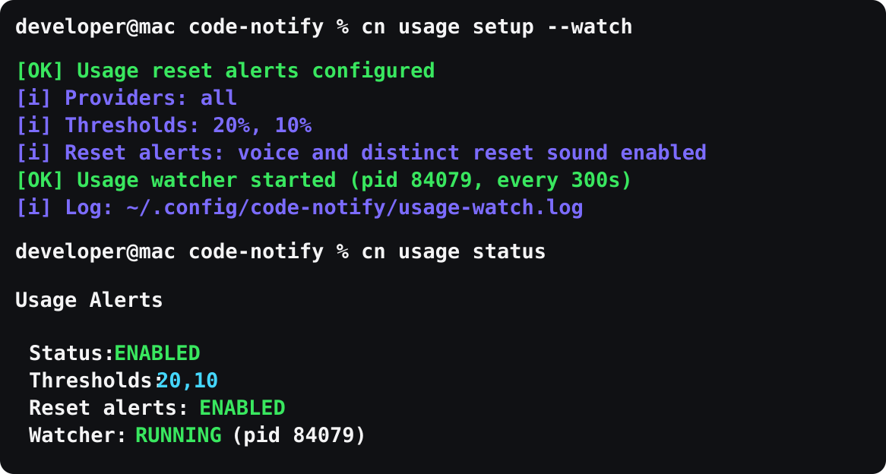

# Code-Notify

> **Official downloads**: https://github.com/xuyangy/code-notify/releases
>
> **Install**: `curl -sSL https://raw.githubusercontent.com/xuyangy/code-notify/main/scripts/install.sh | bash`

Desktop notifications for AI coding tools - get alerts when tasks complete or input is needed.

## Latest: Usage Limit Reset Alerts

Code-Notify can now watch Codex and Claude usage limits and tell you when tokens are back.

- **Daily reset**: `Codex token daily limit reset`
- **Weekly reset**: `Codex token weekly limit reset`
- **Low-usage warnings**: 20% and 10% remaining
- **Delivery options**: desktop notification, voice, sound, Slack, Discord, or ntfy phone push

Voice samples: [Daily reset](https://cdn.jsdelivr.net/gh/xuyangy/code-notify@main/assets/audio/codex-token-daily-limit-reset.m4a) · [Weekly reset](https://cdn.jsdelivr.net/gh/xuyangy/code-notify@main/assets/audio/codex-token-weekly-limit-reset.m4a)

```bash
cn usage setup --watch
cn usage status
```

`cn usage setup --watch` enables usage alerts, turns on distinct reset voice/sound, and starts a background watcher.



<p>
  
  
</p>

[](https://github.com/xuyangy/code-notify/releases)
[](https://opensource.org/licenses/MIT)
[](https://www.apple.com/macos)
[](https://www.linux.org/)
[](https://www.microsoft.com/windows)

---

## What's New in v2026.07.0

This first CalVer release collects the fork-specific work since upstream
`v1.10.0`:

- **Antigravity CLI support** — installs an `agy` plugin, maps permission and
  tool events, debounces inferred completion, and handles errors and paths with
  spaces
- **Modern Codex and Claude hooks** — migrates Codex to `hooks.json`, avoids
  duplicate TUI notifications, and uses immediate Claude permission/question
  lifecycle hooks
- **Deep tmux integration** — click-to-focus, event badges, running indicators,
  an optional animated spinner, approval-resume detection, agent-exit cleanup,
  Codex settle detection, and idle reminders
- **More delivery controls** — persistent alerts, timed snooze, ntfy phone push,
  event-specific messages, and ElevenLabs voice support with fallback and cache
- **Safer, faster notifications** — lower hook latency, detached bookkeeping,
  stronger config preservation, and fixes across badge, approval, and completion
  lifecycles
- **Hardened script installation** — atomic installs from GitHub source tarballs,
  branch/tag/SHA pinning with `CODE_NOTIFY_REF`, and automatic legacy-hook repair

[Full comparison with upstream v1.10.0](https://github.com/mylee04/code-notify/compare/v1.10.0...xuyangy:code-notify:v2026.07.0)

---

## Features

- **Multi-tool support** - Claude Code, OpenAI Codex, Google Gemini CLI, Google Antigravity CLI (`agy`), opencode, pi and omp (oh-my-pi)
- **Agents in containers** - pi and omp run inside Docker (via pi-less-yolo), where nothing can reach the host's notifier. An extension in the bind-mounted state directory spools each lifecycle event, and a host-side relay in the originating tmux pane turns them into ordinary notifications — approval alerts included
- **Works everywhere** - Terminal, VSCode, Cursor, or any editor
- **Cross-platform** - macOS, Linux, Windows
- **Native notifications** - Uses system notification APIs
- **macOS click-through control** - Choose which app notification clicks activate
- **tmux click-to-focus** - Clicking a notification jumps to the exact tmux window/pane the tool runs in. It pairs nicely with a hyperkey workflow: when a notification arrives, hit your shortcut and jump straight back to the exact tmux pane without hunting for which agent is ready. Requires [`terminal-notifier`](https://github.com/xuyangy/terminal-notifier).
- **tmux window badges** - The originating tmux window's name gets the event icon prepended ("🟢 zsh"), so pending work is visible in the status line. For Claude, Antigravity, and Codex hooks.json installs, the badge marks a window as waiting for you and survives merely focusing or visiting it. Claude and Codex clear it on your next prompt; Antigravity clears it when the next turn starts. Legacy Codex `notify =` setups and Gemini, which have no engagement signal, clear it when you switch to the window (manually, by clicking the notification, or via terminal-notifier `-focusLast`). Renaming a badged window yourself keeps your name. By default waiting-type events (idle reminder, permission request) skip the window you are currently looking at — only completion/error badge it; `cn badge-visible on` (or `CODE_NOTIFY_TMUX_BADGE_VISIBLE=true` for a single session) makes every event badge the focused window too. Disable badges entirely with `CODE_NOTIFY_TMUX_BADGE=false` or `touch ~/.claude/notifications/tmux-badge-disabled`
- **tmux running indicator** - While Claude, Codex (hooks.json installs), or Antigravity works on a prompt, its window name carries 🌕 so you can see which windows have an agent busy. Prefer an animated 🌑🌒🌓🌔🌕🌖🌗🌘 spinner in the status line instead? `cn spinner on` renders it via tmux's own status refresh; an event badge always takes display priority and temporarily hides the spinner. A lightweight 5-second check clears either indicator and a pending badge when the agent process exits without a lifecycle hook; set `CODE_NOTIFY_TMUX_AGENT_EXIT_POLL_SECONDS=0` to disable that check. While a permission request or MCP elicitation is waiting, a 2-second check of the pane's rendered content brings the indicator back the moment you answer — Claude Code fires no hook on approval itself, only when the approved tool finishes, so without this a long approved command would show no indicator until it completed (merely glancing at the waiting window doesn't trip it); tune with `CODE_NOTIFY_TMUX_RESUME_POLL_SECONDS` (0 disables) and `CODE_NOTIFY_TMUX_RESUME_POLL_TTL` (how long an unanswered request keeps the check alive, default 15 minutes). Codex ends `/review` without any turn-end hook, so its windows additionally get a pane-settle watch: once the rendered pane has held still for `CODE_NOTIFY_TMUX_SETTLE_SECONDS` (default 15 — Codex repaints every second while working), the indicator comes down and a synthetic task-complete event sends the usual notification and 🟢 badge; `CODE_NOTIFY_TMUX_SETTLE_AGENTS` (pipe-separated, default `codex`) controls which agents are watched. A prompt submitted while the window's indicator is still up hands that indicator to the queued successor turn, so the ending turn's Stop keeps it and withholds its completion badge — and when no successor actually follows (the previous turn ended hook-less, so the hint was false) that badge is applied by a reconcile of its own: the pane holding still for `CODE_NOTIFY_TMUX_PRESERVE_SETTLE_SECONDS` (default 4; values at or above the settle window fall back to it) proves nothing is repainting, which takes a few seconds instead of the full settle window. The indicator still self-expires after 4 hours (`CODE_NOTIFY_TMUX_RUNNING_TTL`) as a safety net for runs that end without a hook — on tmux older than 3.2 the expiry instead lands with the next notification or prompt on that server; disable entirely with `CODE_NOTIFY_TMUX_RUNNING=false`, or change the static icon with `CODE_NOTIFY_TMUX_RUNNING_ICON`
- **tmux approval alerts for Antigravity** - Antigravity's hooks only let code-notify predict an approval pause for shell commands and MCP calls (reconstructed from its own permission lists), so a file-write approval ("Allow creation of this file?") or a subagent's tool approval ("research needs approval for Read") used to pause the turn with no toast and a running indicator that lied. Inside tmux, while an Antigravity turn is running, the agent-exit check also looks at the pane: an approval dialog that stays on screen for `CODE_NOTIFY_TMUX_DIALOG_NOTIFY_SECONDS` (default 5; 0 disables) fires one synthetic `permission_prompt` through the normal pipeline (badge, toast, sounds, snooze, and the same answer-detection poll a predicted approval gets). Honours the `permission_prompt` alert type; an answer landing before the threshold stays silent. `CODE_NOTIFY_TMUX_DIALOG_WATCH_AGENTS` (pipe-separated, default `antigravity`) controls which agents are watched — Claude must not be listed, its native Notification hook already covers every dialog — and the dialog patterns are tunable via `CODE_NOTIFY_TMUX_DIALOG_MARKERS` / `CODE_NOTIFY_TMUX_DIALOG_OPTIONS`
- **tmux interrupt detection** - Cancelling a turn with Escape leaves the running indicator lying. Claude Code fires no hook at all (`Stop` deliberately does not run on a user interrupt), so its spinner used to keep going until your next prompt or the 4-hour TTL; Codex fired no hook either, and its pane-settle watch eventually reported the cancelled turn as "Codex is done" and then nudged you again when it went idle. Inside tmux, while a turn is running the agent-exit check also looks at the pane: the agent's own interrupt line on a pane that has stopped repainting for `CODE_NOTIFY_TMUX_INTERRUPT_SECONDS` (default 5; 0 disables) takes the indicator down **silently** — no toast, sound, voice, or idle nudge, since you pressed Escape and are already at the keyboard. For Codex this runs earlier and on a shorter threshold than the settle watch, so a genuine interrupt ends quietly while an interrupt-free stall still settles into its normal completion. Stillness, not position, is what keeps the scrollback from lying: the interrupt line stays on screen after you submit the next prompt, but a working agent repaints its elapsed counter every second. The match spans the whole visible pane deliberately — Claude Code pins its input box to the bottom row but leaves the transcript where it ended, so on a short session the interrupt line sits near the top with dozens of blank rows below it. `CODE_NOTIFY_TMUX_INTERRUPT_WATCH_AGENTS` (pipe-separated, default `claude|codex|antigravity`) controls which agents are watched and `CODE_NOTIFY_TMUX_INTERRUPT_MARKERS` tunes the pattern (Antigravity is a Claude Code fork and reuses Claude's wording; Codex renders "Conversation interrupted" instead). Antigravity additionally fires its own `Stop` on an interrupt, so its completion alert comes from that hook rather than this watch. The interrupt line is a fast path, not the whole watch, because plenty of cancels leave no text to match: anything that repaints the pane (sourcing `~/.tmux.conf` mid-session, a theme reload, a resize) wipes the line, Escape at a permission prompt records only the API-side `[Request interrupted by user for tool use]`, and Claude Code folds finished steps into an activity summary that hides the tool-level "Interrupted by user". So a pane with no interrupt line at all still gets the indicator taken down once it has held completely still for `CODE_NOTIFY_TMUX_INTERRUPT_QUIET_SECONDS` (default 20; 0 disables) — deliberately far longer than the marker-matched threshold, since the interrupt line is proof and mere silence is inference. Stillness alone is not enough to act on, because a working agent's pane does not reliably keep moving: Claude Code's working line has been seen to stop repainting mid-turn, and in the Ctrl+O transcript view it is not rendered at all. So the quiet path also requires the capture to carry no evidence of a live turn — `CODE_NOTIFY_TMUX_BUSY_MARKERS` for the working line (frozen or animating, its presence is what counts) and the dialog patterns for an approval prompt, which is a pause the notification hooks own rather than an ended turn. That pattern keys on punctuation, never wording, because Claude Code draws the verb at random from a pool shared by both states: a turn in flight trails an ellipsis (`✢ Precipitating…`, `· Precipitating… (8m 0s · ↓ 18.0k tokens)`) while a finished one reads `<verb> for <duration>` with none (`✻ Churned for 14s`, `✻ Sautéed for 1m 8s`). Every alternative in it matches a whole rendered row, anchored at both ends — a spinner frame plus an ellipsis, a `⎿` tool row, a bullet-led working row whose counter group closes the line, the transcript footer's full `· ctrl+o to toggle ·` structure — never a fragment that could land mid-sentence. This veto is persistent, and that decides the trade in the opposite direction to the usual instinct: matching too little costs a spinner cleared early, bounded by the turn and followed by the normal completion alert, whereas a pattern that fires on ordinary transcript prose pins the indicator on for as long as that line stays on screen — the exact bug this path exists to clear, arriving invisibly. So the anchors cover only rows that have actually been captured, and widen only when a real rendering is found to be missed; `(Esc to interrupt)` and `Showing the transcript` are not on their own enough to count, since `The task waits (30s; Esc to interrupt) before retrying` and `Showing the menu; use ctrl+o to toggle details` are things an agent may simply write about its own output. The quiet path is a sub-path of this watch, not a watch of its own, so `CODE_NOTIFY_TMUX_INTERRUPT_SECONDS=0` still switches off the whole thing
- **tmux idle reminder for Codex/Antigravity/opencode** - Claude nudges you natively when it sits waiting (`idle_prompt`); Codex, Antigravity and opencode never do, so a finished window could hold its "complete" badge unattended forever. Inside tmux, their completions arm a short idle watch: after the agent's final UI repaint settles, if the pane's rendered content then holds still for `CODE_NOTIFY_TMUX_IDLE_SECONDS` (default 60; 0 disables) — you never came back — one synthetic `idle_prompt` fires through the normal pipeline (🥱 badge, toast, sounds, rate limiting, snooze) and replaces the earlier completion badge even if the window remains focused. A Codex `/review` that ends hook-less first gets the synthetic completion above, then the same idle watch. Engaging the window — typing, clicking the toast, or (for glance-clear agents) just visiting it — cancels the nudge, and any pane repaint after settling disarms the watch. This is a tmux-derived approximation, not native idle support: outside tmux nothing is watched, it honours the `idle_prompt` alert type, and it rides the agent-exit check, so `CODE_NOTIFY_TMUX_AGENT_EXIT_POLL_SECONDS=0` disables it as well. `CODE_NOTIFY_TMUX_IDLE_AGENTS` (pipe-separated, default `codex|antigravity|opencode`) controls which agents get it
- **Sound notifications** - Play custom sounds on task completion
- **Voice announcements** - Hear when tasks complete (macOS, Windows)
- **ElevenLabs voices** - Optional high-quality cloud TTS for voice announcements (macOS)
- **Slack/Discord/ntfy delivery** - Mirror notifications to webhooks or your phone
- **Codex hook ownership** - Handles Codex completion and approval/edit requests through Codex hooks while disabling duplicate Codex TUI toasts
- **Usage alerts** - Opt-in Codex/Claude 20%, 10%, and reset notifications
- **Rotating tool-specific messages** - "Claude is idle", "Codex wrapped up", and other short variants are chosen randomly per event
- **Project-specific settings** - Different configs per project
- **Quick aliases** - `cn` and `cnp` for fast access

## Installation

This fork supports installation through the hosted shell scripts only. Homebrew
and npm do not distribute this fork.

### For Humans

**macOS / Linux / WSL**

```bash
curl -sSL https://raw.githubusercontent.com/xuyangy/code-notify/main/scripts/install.sh | bash
cn on
```

**Windows**

```powershell
irm https://raw.githubusercontent.com/xuyangy/code-notify/main/scripts/install-windows.ps1 | iex
```

**Update an existing install**

```bash
cn update
code-notify version
```

**Install a specific release or ref**

By default the installer pulls the latest `main`. Set `CODE_NOTIFY_REF` to install a
specific branch, tag, or commit SHA instead — useful for pinning a known-good
version or testing a branch:

```bash
# pin to a release tag
curl -sSL https://raw.githubusercontent.com/xuyangy/code-notify/main/scripts/install.sh | CODE_NOTIFY_REF=v2026.08.1 bash

# or a branch / commit SHA
CODE_NOTIFY_REF=my-branch bash scripts/install.sh
```

Note: `CODE_NOTIFY_REF` selects the code that gets installed; the `install.sh` you pipe
to `bash` is always fetched from `main`. The ref is ignored when installing from a local
checkout (it copies your working tree).

On Windows, fetch the installer from the release tag itself:

```powershell
irm https://raw.githubusercontent.com/xuyangy/code-notify/v2026.08.1/scripts/install-windows.ps1 | iex
```

Published releases contain source code only; the installers copy the appropriate
scripts into your user-level installation directory.

**Versioning**

This fork uses `vYYYY.MM.PATCH` CalVer tags to avoid collisions with upstream's
SemVer releases. `v2026.07.0` is the first release in July 2026; another release
in the same month would be `v2026.07.1`.

If you were using the older `claude-notify` hook layout, supported upgrades now repair those Claude hooks automatically. On Windows, that repair also covers older `notify.ps1` hook layouts and alternate Claude settings locations such as `%USERPROFILE%\.config\.claude\settings.json`. Existing unrelated Claude hooks are preserved during enable/disable operations.

### For AI Coding Agents

Paste this to your AI coding agent (Claude Code, Codex, Cursor, Gemini CLI, etc.):

```
Install code-notify with the install script.

curl -sSL https://raw.githubusercontent.com/xuyangy/code-notify/main/scripts/install.sh | bash
cn on all
cn test
cn status
```

Expected result:

- `cn test` shows a desktop notification.
- `cn status` shows enabled tools.

See [docs/installation.md](docs/installation.md) for more details.

## Usage


| Command              | Description                                  |
| -------------------- | -------------------------------------------- |
| `cn on`              | Enable notifications for all detected tools  |
| `cn on all`          | Explicit alias for enabling all detected tools |
| `cn on claude`       | Enable for Claude Code only                  |
| `cn on codex`        | Enable Codex hooks and suppress duplicate Codex TUI toasts |
| `cn on gemini`       | Enable for Gemini CLI only                   |
| `cn on antigravity`  | Enable for Antigravity CLI (`agy`); `cn on agy` also works |
| `cn on opencode`     | Enable for opencode (installs a plugin in its config directory) |
| `cn on pi`           | Enable for pi (containerized via pi-less-yolo) |
| `cn on omp`          | Enable for omp (oh-my-pi); `cn on oh-my-pi` also works |
| `cn off`             | Disable notifications                        |
| `cn off all`         | Explicit alias for disabling all tools       |
| `cn test`            | Send test notification                       |
| `cn status`          | Show current status                          |
| `cn update`          | Update code-notify                           |
| `cn update check`    | Check the latest release and show the update command |
| `cn click-through`   | Show current macOS click-through mappings    |
| `cn click-through add <app>` | Add a macOS click-through mapping    |
| `cn alerts`          | Configure which events trigger notifications |
| `cn alerts persist`  | Keep selected alerts visible until closed    |
| `cn channels`        | Configure Slack/Discord/ntfy delivery        |
| `cn snooze <time>`   | Pause all notifications (30m, 2h, off)       |
| `cn wording status` | Show wording and project-name settings |
| `cn wording banner short\|long\|reset` | Set or reset banner wording (default short) |
| `cn wording voice short\|long\|reset` | Set or reset spoken wording (default long) |
| `cn wording project banner on\|off\|reset` | Show or hide the project name in banners (default on) |
| `cn wording project voice on\|off\|reset` | Show or hide the project name in voice messages (default on) |
| `cn usage`           | Configure Codex/Claude usage alerts          |
| `cn spinner on`      | Use the animated tmux running indicator      |
| `cn spinner off`     | Use the static tmux running indicator        |
| `cn spinner status`  | Show the tmux spinner setting                |
| `cn badge-visible on` | Badge the focused tmux window on every event |
| `cn badge-visible off` | Skip the focused window for waiting events (default) |
| `cn sound on`        | Enable sound notifications                   |
| `cn sound set <path>`| One sound for every event (turns per-event sounds off) |
| `cn sound pool <dir>`| Random per-event sounds from `<dir>/<event>/` |
| `cn sound pool on\|off` | Turn per-event sounds on or off           |
| `cn voice on`        | Enable voice (macOS, Windows)                |
| `cn voice on claude` | Enable voice for Claude only                 |
| `cn voice engine elevenlabs` | Use ElevenLabs cloud voice (macOS)   |
| `cn voice elevenlabs key <key>` | Store your ElevenLabs API key     |
| `cn voice queue on`  | Speak overlapping voices one at a time (macOS) |
| `cnp on`             | Enable for current project only              |

When enabling project notifications with `cnp on`, Code-Notify warns if Claude project trust does not appear to be accepted yet.
Project-scoped Claude hooks override the global mute file, so `cn off` will not suppress a project where `cnp on` is enabled.
`all` is also accepted as an explicit alias for global commands such as `cn on all`, `cn off all`, and `cn status all`.

### Per-Event Sounds

Point Code-Notify at a directory of sound folders and every alert plays a
**random** file from the folder matching its event, so the same event never
sounds stale:

```bash
cn sound pool ~/sounds     # each event reads ~/sounds/<event>/
cn sound pool              # show folders and how many sounds each holds
cn sound test error        # play a random sound from the error pool
cn sound pool off          # one sound for everything again
cn sound pool on           # back to per-event sounds (same folder as before)
cn sound pool default      # forget the folder, back to ~/.claude/notifications/sounds
```

| Folder         | Event                                | Falls back to  |
| -------------- | ------------------------------------ | -------------- |
| `complete/`    | Task finished                        | `idle/`        |
| `idle/`        | Idle reminder                        | —              |
| `question/`    | Input required / AskUserQuestion     | `permission/`  |
| `permission/`  | Approval prompt                      | `question/`    |
| `error/`       | Errors and failures                  | —              |
| `limit/`       | Usage limit reached                  | `error/`       |
| `usage/`       | Usage alerts                         | `error/`       |
| `reset/`       | Tokens reset                         | `complete/`, `idle/` |
| `test/`        | `cn test`                            | `complete/`, `idle/` |
| `notification/`| Anything else                        | `idle/`        |
| `subagent-start/` | Subagent launched                 | `notification/`, `idle/` |
| `subagent-stop/`  | Subagent finished                 | `complete/`, `idle/` |
| `teammate-idle/`  | Teammate waiting for input        | `idle/`        |
| `task-created/`   | Agent-team task opened            | `notification/`, `idle/` |
| `task-completed/` | Agent-team task done              | `complete/`, `idle/` |

The subagent and agent-team folders also answer to their hook-type spelling, so
`SubagentStop/` works as well as `subagent-stop/`.

Folders are optional: an event with no folder (or an empty one) falls back as
shown above, and finally to the single sound from `cn sound set`. Supported
formats are `.wav`, `.aiff`, `.aif`, `.mp3`, `.ogg`, `.oga`, `.m4a`, and
`.flac` (Windows plays `.wav` only). Only files sitting directly in an event
folder count — sounds tucked into a sub-folder are ignored.

`cn sound set <path>` turns per-event sounds **off**, so that one file plays for
everything; the pool folder is remembered, so `cn sound pool on` (or naming a
folder again) brings the per-event sounds straight back.

### tmux Running Spinner

By default, an active Claude, Codex, or Antigravity agent is marked with a static
🌕 icon in its tmux window name. To show an animated 🌑🌒🌓🌔🌕🌖🌗🌘 indicator in tmux's
status line instead:

```bash
cn spinner on
cn spinner status
cn spinner off
```

`cn spinner on` saves the preference; the spinner is armed when the next agent
run starts. Run `cn spinner off` from inside the affected tmux server to remove
a live status-line spinner immediately. Agents that are still running fall back
to the static 🌕 window-name icon. The disarm path leaves a status format or
refresh interval that you changed while the spinner was active untouched.

Set `CODE_NOTIFY_TMUX_SPINNER=true` or `CODE_NOTIFY_TMUX_SPINNER=false` to
override the saved preference for a single process or session.

### Notification Wording and Project Names

You can choose between short and friendly notification text independently for
desktop banners and voice announcements. By default, banners use the short
style and voice announcements use the long style:

```bash
cn wording banner short       # e.g. "Claude needs your approval"
cn wording banner long        # e.g. "Attention please! Claude needs your permission to continue"
cn wording voice short        # Use terse spoken wording
cn wording voice long         # Use friendlier spoken wording
```

Project names are included in both banners and voice announcements by default.
You can turn them off independently, or turn them back on later. `cn test`
banners always identify the project so you can confirm delivery, even while
the banner toggle is off:

```bash
cn wording project banner off
cn wording project voice off

cn wording project banner on
cn wording project voice on
```

Show the current wording and project-name settings with `cn wording status`
(plain `cn wording` does the same):

```bash
cn wording status
```

To restore the defaults, use `reset` in place of `short`, `long`, `on`, or
`off` for the relevant setting. For example:

```bash
cn wording banner reset
cn wording voice reset
cn wording project banner reset
cn wording project voice reset
```

Set `CODE_NOTIFY_BANNER_WORDING` or `CODE_NOTIFY_VOICE_WORDING` to `short` or
`long`, and `CODE_NOTIFY_BANNER_PROJECT` or `CODE_NOTIFY_VOICE_PROJECT` to
`on` or `off`, to override the saved preferences for a single process or
session.

## How It Works

Code-Notify uses the hook systems built into AI coding tools:

- **Claude Code**: `~/.claude/settings.json`
- **Codex**: `~/.codex/hooks.json`
- **Gemini CLI**: `~/.gemini/settings.json`
- **Antigravity CLI (`agy`)**: imported plugin at `~/.claude/notifications/agy-plugin/` (registered with `agy plugin install`)
- **opencode**: plugin at `~/.config/opencode/plugin/code-notify.ts`
- **pi**: extension at `~/.pi/agent/extensions/code-notify.ts`
- **omp (oh-my-pi)**: extension at `~/.omp/agent/extensions/code-notify.ts`

For Codex, Code-Notify configures `~/.codex/hooks.json` with Codex lifecycle hooks and disables Codex TUI notifications in `~/.codex/config.toml` to avoid duplicate toasts. The `Stop` hook sends task-complete notifications. When `permission_prompt` is enabled, Code-Notify also adds a `PermissionRequest` hook for approval/edit requests.

For Antigravity CLI, Code-Notify builds a small plugin and registers it with `agy plugin install`. Antigravity hooks receive their payload on stdin and pass no arguments, so each event runs a tiny wrapper that pipes the payload into the notifier. The mapping reflects what `agy` actually executes today (tested against `agy` 1.1.3; requires 1.1.3+ — older builds reject the flat lifecycle-hook entries in `hooks.json`):

- **Input needed** — a `PreToolUse` hook fires before every tool call; the notifier banners only calls that pause for approval — `run_command` and MCP tool calls (`call_mcp_tool`, or eagerly loaded `mcp_<server>_<tool>` tools) that Antigravity's own permission lists (`command(...)`/`mcp(<server>/<tool>)` rules) won't auto-run — and only while the `permission_prompt` alert type is enabled. Unlisted MCP tools default to a prompt, so they banner.
- **Working indicator** — a `PreInvocation` hook fires before every model call, so the tmux running indicator lights when a turn starts (including turns that never call a tool) and comes back after you answer an approval prompt.
- **Task complete / errors** — the native `Stop` hook delivers the turn end: a clean end sends "task complete", a turn that died sends a failure alert with the error. A failing `PostToolUse` step (string or structured error) additionally fires an immediate failure alert mid-turn and cancels any pending completion for that step.
- **Fallback completion** — the first turn of each conversation also arms a debounced `PostToolUse` guess ("quiet for `CODE_NOTIFY_AGY_DEBOUNCE_SECONDS` seconds, and inside tmux the pane has settled, bounded by `CODE_NOTIFY_AGY_SETTLE_MAX_SECONDS`" — defaults 8 and 120). Once a native `Stop` is observed for the conversation the guess is skipped entirely; if an `agy` build ships with lifecycle hooks broken again, the fallback keeps delivering completions.
- **Idle reminder** — inside tmux, a completion also arms the tmux-derived idle watch: if the pane then holds still for `CODE_NOTIFY_TMUX_IDLE_SECONDS` (default 60) without you engaging the window, one synthetic `idle_prompt` nudge fires (see the feature list above).

Disable everything with `cn off antigravity`, which runs `agy plugin uninstall code-notify`.

### opencode

`cn on opencode` writes one plugin into opencode's config directory, which
auto-loads every `plugin/*.ts` it finds there. Nothing else is touched — in
particular not `opencode.jsonc`, which is JSONC (comments and trailing commas
are legal in it) and would lose its comments to any JSON rewriter.

The plugin runs inside opencode and calls the notifier itself, so there is
nothing else to install or keep running: no relay process, no log watcher, no
wrapper around the `opencode` command.

Everything code-notify does works for opencode, the same way it does for a
Claude or Codex hook — desktop banners, sounds, voice, snooze, the kill
switch, tmux badges, the running indicator and click-to-focus. The one thing
that is not guaranteed is *which tmux window* the badge and click-to-focus
land on; see the note below. What each opencode event maps to:

- **Input needed** — `permission.asked` fires only when opencode will actually
  stop and wait for you, so approvals that its permission rules auto-run never
  notify. `question.asked` (the question tool) is treated the same way, as an
  `elicitation_dialog`. Answering either resumes the running indicator. Both
  are gated by their alert types and gated separately, so `cn alerts add
  permission_prompt` leaves questions silent until you add
  `elicitation_dialog` too — `cn status` reports each on its own line. The
  versioned spellings opencode also emits (`permission.v2.asked` and friends)
  map to the same handlers, and one request announced under both is announced
  once.
- **Working indicator** — a user prompt lights it; opencode reporting the
  session busy keeps it lit for a turn that began before the plugin loaded.
- **Task complete** — `session.status` reaching idle, which is opencode's
  canonical turn end; `session.idle` is deprecated upstream and kept as the
  compatibility path for older versions. Both are emitted today, so the plugin
  tracks whether a turn is in flight and announces exactly one completion
  either way.
- **Idle reminder** — opencode has no native "still waiting for you" nudge, so
  inside tmux a completion also arms the tmux-derived idle watch: if the pane
  then holds still for `CODE_NOTIFY_TMUX_IDLE_SECONDS` (default 60) without you
  engaging the window, one synthetic `idle_prompt` fires (see the feature list
  above).
- **Errors** — `session.error` raises a failure alert carrying the error class
  and takes the running indicator down.
- **Interrupts** — an aborted turn (`MessageAbortedError`) takes the indicator
  down **silently**: you pressed Escape, so there is nothing to announce.
- **Subagents** — a subagent's turn end is not your turn end, and neither is
  its failure or its interruption: none of them are announced, and none touch
  your turn's running indicator. Its approval and question prompts are
  announced, because they still stop and wait for you.

One limitation: plugins run inside the opencode **server**, so the tmux pane
they see is the one the server was started in. Launching `opencode` in a pane
(the normal case) is correct; attaching a TUI to a pre-existing server (`opencode
serve`, or a fixed `server.port` in the config) means tmux badges and
click-to-focus target the server's window instead. Desktop, voice and channel
delivery are unaffected.

Disable with `cn off opencode`, which removes the plugin file.

Note that opencode compatibility plugins such as `oh-my-openagent` replay
Claude Code's hooks from `settings.json` inside opencode. Those replayed hooks
describe a lifecycle opencode does not have, so the notifier ignores them
(it recognises opencode by the `OPENCODE` variables opencode exports) and acts
only on this plugin's own events.

`oh-my-openagent` also ships a notifier of its own — a `session-notification`
hook that toasts "Agent is ready for input" at every turn end. It does try to
stand down when another notification plugin is present, but it looks only at the
`plugin` array of `opencode.json`/`opencode.jsonc`, and only for a short list of
known package names. code-notify is neither: it is a drop-in file in `plugin/`,
which opencode auto-loads without the config ever naming it. So that detection
cannot see it, both notifiers stay on, and every completion arrives twice. Turn
the other one off with:

```json
{
  "disabled_hooks": ["session-notification"]
}
```

in `~/.config/opencode/oh-my-openagent.json` (`.jsonc` works too, as does the
legacy `oh-my-opencode` basename), then restart opencode — those hooks are wired
when the plugin loads. `cn on opencode` prints this hint when it finds the plugin
in your opencode config; it never edits that file, which belongs to another tool.

### pi and omp, which run in a container

[pi](https://github.com/earendil-works/pi/tree/main/packages/coding-agent) and [omp (oh-my-pi)](https://github.com/can1357/oh-my-pi) are normally launched through [pi-less-yolo](https://github.com/cjermain/pi-less-yolo), which runs them inside a Docker container. Nothing in there can deliver a notification: the container has no `$TMUX`, no access to the host tmux socket, and no notification binary. So the bridge is split in two.

The **agent-side half** is an ordinary extension, written by `cn on pi` / `cn on omp` into the agent state directory that pi-less-yolo already bind-mounts — so the container sees it as auto-discovered, and no image rebuild or run-flag change is involved. It does not notify; it appends one small file per lifecycle event to a spool directory inside that same mount.

The **host-side half** is `code-notify relay <agent> <spool>`, started by the pi-less-yolo run task in the tmux pane the container renders into, and stopped when `docker run` returns. It reads those files in order and invokes the notifier exactly as an in-process hook would, so badges, the running indicator, click-to-focus, snooze, sounds and voice all work unchanged. Nothing polls while no agent is running.

That second half needs the launcher to cooperate, which means one small patch to your pi-less-yolo clone (`tasks/pi/_docker_flags` exports `CODE_NOTIFY_SPOOL`; `tasks/pi/_default` and `tasks/omp/_default` start and stop the relay). `cn status` reports whether it is in place — without it the container spools events nobody reads. Set `PI_NO_CODE_NOTIFY=1` to skip the bridge for a run.

Events, by agent:

- **omp** — `input` starts the running indicator, `tool_approval_requested` fires the approval alert (gated by the `permission_prompt` alert type), the `ask` tool fires `elicitation_dialog`, `tool_approval_resolved` brings the indicator back once you answer, and `agent_end` delivers task-complete or, for a turn that died, a failure alert. omp settles an interrupt through that same `agent_end`, so the outcome is read from the turn's last assistant message: cancelling with Escape retires the indicator silently instead of announcing a completion, the same way the tmux interrupt watch handles Claude and Codex.
- **pi** — `input` and `agent_settled` only. pi has no tool-approval prompt of its own (the container is what constrains it), so there is no approval event to relay.

Quitting mid-turn (`/exit`, Ctrl-C, a container that dies) retires the running indicator silently — there is no completion to announce, but a spinner must not outlive the session.

One known gap: omp's `input` event covers prompts typed into its editor, not a prompt supplied on the command line, so `mise run omp -- "do the thing"` gets no running indicator for that **first** turn. Everything else about that turn still works — approval alerts and the completion notification both fire — and every prompt typed afterwards behaves normally. The fix would be to switch to omp's `message_start` event, which is what its own notification integration uses; it is left alone deliberately, because getting the message filter slightly wrong fires `prompt_submit` twice per turn, and a second submission while the indicator is up reads as a queued successor and makes the turn's completion withhold its badge. A missing spinner on one turn of one invocation style is the better failure.

Disable with `cn off pi` / `cn off omp`, which removes the extension.

For Claude Code, it adds hooks like:

```json
{
  "hooks": {
    "Stop": [
      {
        "matcher": "",
        "hooks": [{ "type": "command", "command": "notify.sh stop claude" }]
      }
    ],
    "Notification": [
      {
        "matcher": "idle_prompt",
        "hooks": [
          { "type": "command", "command": "notify.sh notification claude" }
        ]
      }
    ],
    "PermissionRequest": [
      {
        "matcher": "",
        "hooks": [
          { "type": "command", "command": "notify.sh notification claude" }
        ]
      }
    ],
    "StopFailure": [
      {
        "matcher": "",
        "hooks": [
          { "type": "command", "command": "notify.sh StopFailure claude" }
        ]
      }
    ],
    "SubagentStop": [
      {
        "matcher": "",
        "hooks": [
          { "type": "command", "command": "notify.sh SubagentStop claude" }
        ]
      }
    ]
  }
}
```

The Claude `PermissionRequest` hook is installed only when `permission_prompt`
is enabled. It fires as the approval dialog is created, so the alert is not
delayed when the Ctrl+O verbose transcript is open. Claude's `Notification`
hook continues to handle idle, authentication, and MCP-input alerts.

`StopFailure` fires when a turn ends on an API error instead of a normal
`Stop` — most notably when the usage limit is reached mid-task and you choose
to stop and wait. A `rate_limit` failure pauses the tmux running indicator
(the spinner stops instead of spinning forever) and badges the window ⏳ with
a "Limit Reached" alert; the indicator comes back when the turn resumes or
you submit the next prompt. Any other error class (server error, billing,
etc.) is delivered as a regular 🧨 failure alert.

For Codex, it manages hooks like:

```json
{
  "hooks": {
    "Stop": [
      {
        "hooks": [{ "type": "command", "command": "notify.sh stop codex" }]
      }
    ],
    "PermissionRequest": [
      {
        "matcher": "*",
        "hooks": [
          { "type": "command", "command": "notify.sh notification codex" }
        ]
      }
    ]
  }
}
```

And while Codex is enabled, Code-Notify owns notification delivery by writing this managed override:

```toml
[tui]
# Code-Notify: Codex notifications are handled by hooks
notifications = false
```

### Alert Types


By default, Claude/Gemini input alerts use `idle_prompt`, while Codex always uses its `Stop` hook for task completion. You can customize additional alert types:

```bash
cn alerts                          # Show current config
cn alerts add permission_prompt    # Also notify on tool permission requests
cn alerts add ask_user             # Notify immediately when Claude asks a question
cn alerts add SubagentStop         # Also notify when Claude subagents finish
cn alerts remove permission_prompt # Remove permission notifications
cn alerts reset                    # Back to default (idle_prompt only)
```

| Type                 | Description                                    |
| -------------------- | ---------------------------------------------- |
| `idle_prompt`        | AI is waiting for your input (default)         |
| `permission_prompt`  | AI needs tool permission (Y/n)                 |
| `auth_success`       | Authentication success                         |
| `elicitation_dialog` | MCP tool input needed                          |
| `ask_user`           | Claude asks a question via AskUserQuestion     |
| `SubagentStart`      | Claude subagent started                        |
| `SubagentStop`       | Claude subagent completed                      |
| `TeammateIdle`       | Claude teammate is waiting for input           |
| `TaskCreated`        | Claude agent-team task was created             |
| `TaskCompleted`      | Claude agent-team task completed               |

Alert-type matching applies to Claude Code `Notification` and `PermissionRequest` hooks, Codex `PermissionRequest` hooks, Gemini CLI notification hooks, the Antigravity CLI `PreToolUse` hook, and opencode's permission/question events. For Antigravity, the `PreToolUse` hook is always installed (it doubles as a "still working" signal); `permission_prompt` gates the approval banner at runtime, so changes take effect without reinstalling. `ask_user` is a Claude-only `PreToolUse` hook for `AskUserQuestion`; it is applied immediately when Claude notifications are already enabled. Claude Code agent/team events are separate hook events and are opt-in via `cn alerts add SubagentStop`, `cn alerts add TeammateIdle`, or `cn alerts add TaskCompleted`. After changing alert types, run `cn on` or `cn on codex` again to rewrite the managed hooks (Antigravity needs no rewrite).

Agent-team and subagent workflows can be noisy if `permission_prompt` is enabled. If you only want idle pings for Claude/Gemini and completion alerts for Codex, run `cn alerts remove permission_prompt && cn on`. Codex exposes no native `idle_prompt` hook, and neither do Antigravity or opencode; inside tmux, the `idle_prompt` alert type instead gates the tmux-derived post-completion idle reminder for all three (see the feature list above). `permission_prompt` controls Codex approval/edit alerts through `PermissionRequest`.

For each delivered event, Code-Notify randomly chooses from a small set of short messages for that event. For example, an `idle_prompt` may say `Claude is idle`, `Claude is waiting`, `Claude is ready for you`, or `Claude can take more work now`.

### Badge Icons & Event Mapping

When notifications are triggered, Code-Notify prepends an emoji icon to the terminal notification title and/or the tmux window name. The following table maps the event type (and subtype) to its corresponding badge icon:

| Event/Hook Type | Subtype/Condition | Badge Icon | Description / Scenario |
| --- | --- | :---: | --- |
| `stop` | - | `🟢` | Task completed |
| `TaskCompleted` | - | `📗` | Agent-team task completed |
| `notification` | `idle_prompt` | `🥱` | AI is idle, waiting for input |
| `notification` | `permission_prompt` | `💬` | AI needs tool permission (Y/n) |
| `notification` | `elicitation_dialog` | `💬` | MCP tool input needed |
| `notification` | `auth_success` | `💬` | Authentication success |
| `notification` | other / fallback | `💬` | Generic input request / auth |
| `PreToolUse` | AskUserQuestion (`ask_user`) | `🙋` | Claude asks a question |
| `SubagentStart` | - | `🍃` | Subagent started |
| `SubagentStop` | - | `🍂` | Subagent completed |
| `TeammateIdle` | - | `💤` | Teammate is waiting for input |
| `TaskCreated` | - | `📙` | Agent-team task was created |
| `error` / `failed` | - | `🧨` | Task or tool execution failed |
| `test` | - | `🧪` | Test notification |
| other events | - | `📢` | General status update / fallback |

*Note: Usage alerts (`usage` and `usage_reset`) fire from the background watcher rather than a specific terminal pane, so they do not have a corresponding tmux window badge icon.*

### Persistent Notifications

By default, desktop notifications auto-hide after a few seconds. You can mark specific alert types as persistent so they stay visible until you close them, or until a timeout you choose (default 12 hours):

```bash
cn alerts persist add permission_prompt  # Keep permission requests on screen
cn alerts persist add stop               # Keep task-complete alerts on screen
cn alerts persist timeout 12h            # Hide after 12 hours (default)
cn alerts persist timeout 0              # Stay until manually closed
cn alerts persist                        # Show current config
cn alerts persist reset                  # Back to normal banners
```

- **macOS**: requires [alerter](https://github.com/vjeantet/alerter) (`brew install alerter`); without it, persistent types fall back to normal banners. Clicking the alert still focuses your terminal (and the originating tmux window/pane when applicable).
- **Linux**: persistent alerts are sent with critical urgency, which GNOME/KDE keep on screen until dismissed.
- **Windows**: persistent alerts use a reminder toast with a Dismiss button.

Persistence only changes how long a notification stays visible. Which events notify at all is still controlled by `cn alerts add/remove`, and `stop` (task complete) can be made persistent even though it is not an alert-type filter.

### Slack, Discord, And ntfy (Phone Push)

Code-Notify can also send the same notification to Slack, Discord, or [ntfy](https://ntfy.sh) through webhooks. Desktop notifications still work normally; remote delivery is an extra channel. ntfy delivers push notifications to your phone via the ntfy app — subscribe to your topic there, and pick a hard-to-guess topic name since topics are open by default.

```bash
cn channels add slack https://hooks.slack.com/services/...
cn channels add discord https://discord.com/api/webhooks/...
cn channels add ntfy https://ntfy.sh/my-private-topic --name phone
cn channels status
cn channels test all
```

Webhook URLs are stored locally in `~/.config/code-notify/channels.json` and are redacted in `cn status`. Self-hosted ntfy servers work too (any `https://<server>/<topic>` URL).

### Snooze

Pause every notification — including approval prompts — for a fixed time, then resume automatically. No daemon involved; expiry is checked when the next event fires.

```bash
cn snooze 30m     # also accepts 2h, 90s, or bare minutes
cn snooze status
cn snooze off
```

### Voice Queue

When several agents finish at the same time (parallel sessions, sub-agents), each
completion speaks its own announcement and the voices can overlap. `cn voice queue on`
opts into serialized speech: concurrent utterances wait their turn and play one at a
time, an identical phrase arriving within `CODE_NOTIFY_SPEECH_DEDUP_SECONDS` (default
10) of the previous one is spoken once, and a phrase still waiting after
`CODE_NOTIFY_SPEECH_MAX_WAIT_SECONDS` (default 15) is dropped instead of spoken
stale — the banner already delivered it. Dropped phrases are logged to
`~/.claude/logs/notifications.log` with a `[speech]` tag. A crashed speaker's
lock is reclaimed automatically, and a hung one can only ever stall the queue
for `CODE_NOTIFY_SPEECH_LOCK_TTL_SECONDS` (default 60, 0 disables the bound).

```bash
cn voice queue on       # Speak overlapping voices one at a time
cn voice queue off      # Default: play every voice immediately (may overlap)
cn voice queue status
```

The queue is off by default so nothing changes unless you opt in. For a single
session, `CODE_NOTIFY_SPEECH_SERIALIZE=true` (or `false`) overrides the stored
setting in either direction. The queue is macOS-only: the Windows notifier
speaks asynchronously and does not implement it.

### ElevenLabs Voices

By default, voice announcements use the built-in macOS voice (`say`). You can switch to [ElevenLabs](https://elevenlabs.io) for higher-quality cloud voices.

```bash
cn voice on                                  # Enable voice first
cn voice engine elevenlabs                   # Switch TTS engine
cn voice elevenlabs key <your-api-key>       # Store your API key
cn voice elevenlabs list                     # List voices (with category + plan)
cn voice elevenlabs voice <voice-id>         # Pick a voice (default: Rachel)
cn voice elevenlabs model <model-id>         # Default: eleven_flash_v2_5
cn voice elevenlabs test                     # Speak a test message
cn voice engine system                       # Switch back to the built-in voice
```

Notes:

- ElevenLabs voice applies on macOS. If a call fails (no key, network error, or quota exhausted), Code-Notify automatically falls back to the built-in `say` voice so you still hear the announcement. `cn voice elevenlabs test` reports the specific API error when it fails.
- `cn voice elevenlabs list` shows each voice's category and plan. Voices marked `paid only` (ElevenLabs `professional`/`library` voices) require a paid ElevenLabs plan; voices marked `free ok` (e.g. `premade`) work on the free tier.
- Synthesized audio is cached in `~/.cache/code-notify/tts/`, so repeated selected phrases do not make repeat API calls. Cache filenames include the project name and their timestamp is refreshed on use, making stale entries easy to prune by age.
- A failed synthesis (outage, invalid key, quota) is not retried for the same phrase within `CODE_NOTIFY_TTS_FAIL_BACKOFF_SECONDS` (default 30, 0 disables) — a burst of identical events during an outage makes one request, and the rest fall back to `say` immediately instead of each repeating the doomed call.
- Your API key is stored locally in `~/.config/code-notify/tts.json` (permissions `600`) and is redacted in `cn voice status`.
- `eleven_flash_v2_5` is the default model — it is the fastest and cheapest, which suits short notification phrases. Use `eleven_multilingual_v2` for higher quality.

#### Free-tier voices and preview links

The exact list comes from your ElevenLabs account at runtime, but these are the standard free-tier-safe `premade` voices. Open any preview URL in your browser to hear the sample voice before setting it in Code-Notify.

| Voice | Voice ID | Preview |
| --- | --- | --- |
| Roger | `CwhRBWXzGAHq8TQ4Fs17` | [hear](https://api.us.elevenlabs.io/v1/voices/CwhRBWXzGAHq8TQ4Fs17/previews/audio?payload=eyJ2b2ljZV9zb3VyY2UiOiJwcmVtYWRlIiwiZmlsZW5hbWUiOiI1OGVlM2ZmNS1mNmYyLTQ2MjgtOTNiOC1lMzhlYjMxODA2YjAubXAzIiwidGltZXN0YW1wIjoxNzgxOTAyODAwMDAwMDAwfQ%3D%3D) |
| Sarah | `EXAVITQu4vr4xnSDxMaL` | [hear](https://api.us.elevenlabs.io/v1/voices/EXAVITQu4vr4xnSDxMaL/previews/audio?payload=eyJ2b2ljZV9zb3VyY2UiOiJwcmVtYWRlIiwiZmlsZW5hbWUiOiIwMWEzZTMzYy02ZTk5LTRlZTctODU0My1mZjIyMTZhMzIxODYubXAzIiwidGltZXN0YW1wIjoxNzgxOTAyODAwMDAwMDAwfQ%3D%3D) |
| Laura | `FGY2WhTYpPnrIDTdsKH5` | [hear](https://api.us.elevenlabs.io/v1/voices/FGY2WhTYpPnrIDTdsKH5/previews/audio?payload=eyJ2b2ljZV9zb3VyY2UiOiJwcmVtYWRlIiwiZmlsZW5hbWUiOiI2NzM0MTc1OS1hZDA4LTQxYTUtYmU2ZS1kZTEyZmU0NDg2MTgubXAzIiwidGltZXN0YW1wIjoxNzgxOTAyODAwMDAwMDAwfQ%3D%3D) |
| Charlie | `IKne3meq5aSn9XLyUdCD` | [hear](https://api.us.elevenlabs.io/v1/voices/IKne3meq5aSn9XLyUdCD/previews/audio?payload=eyJ2b2ljZV9zb3VyY2UiOiJwcmVtYWRlIiwiZmlsZW5hbWUiOiIxMDJkZTZmMi0yMmVkLTQzZTAtYTFmMS0xMTFmYTc1YzU0ODEubXAzIiwidGltZXN0YW1wIjoxNzgxOTAyODAwMDAwMDAwfQ%3D%3D) |
| George | `JBFqnCBsd6RMkjVDRZzb` | [hear](https://api.us.elevenlabs.io/v1/voices/JBFqnCBsd6RMkjVDRZzb/previews/audio?payload=eyJ2b2ljZV9zb3VyY2UiOiJwcmVtYWRlIiwiZmlsZW5hbWUiOiJlNjIwNmQxYS0wNzIxLTQ3ODctYWFmYi0wNmE2ZTcwNWNhYzUubXAzIiwidGltZXN0YW1wIjoxNzgxOTAyODAwMDAwMDAwfQ%3D%3D) |
| Callum | `N2lVS1w4EtoT3dr4eOWO` | [hear](https://api.us.elevenlabs.io/v1/voices/N2lVS1w4EtoT3dr4eOWO/previews/audio?payload=eyJ2b2ljZV9zb3VyY2UiOiJwcmVtYWRlIiwiZmlsZW5hbWUiOiJhYzgzM2JkOC1mZmRhLTQ5MzgtOWViYy1iMGY5OWNhMjU0ODEubXAzIiwidGltZXN0YW1wIjoxNzgxOTAyODAwMDAwMDAwfQ%3D%3D) |
| River | `SAz9YHcvj6GT2YYXdXww` | [hear](https://api.us.elevenlabs.io/v1/voices/SAz9YHcvj6GT2YYXdXww/previews/audio?payload=eyJ2b2ljZV9zb3VyY2UiOiJwcmVtYWRlIiwiZmlsZW5hbWUiOiJlNmM5NWYwYi0yMjI3LTQ5MWEtYjNkNy0yMjQ5MjQwZGVjYjcubXAzIiwidGltZXN0YW1wIjoxNzgxOTAyODAwMDAwMDAwfQ%3D%3D) |
| Harry | `SOYHLrjzK2X1ezoPC6cr` | [hear](https://api.us.elevenlabs.io/v1/voices/SOYHLrjzK2X1ezoPC6cr/previews/audio?payload=eyJ2b2ljZV9zb3VyY2UiOiJwcmVtYWRlIiwiZmlsZW5hbWUiOiI4NmQxNzhmNi1mNGI2LTRlMGUtODViZS0zZGUxOWY0OTA3OTQubXAzIiwidGltZXN0YW1wIjoxNzgxOTAyODAwMDAwMDAwfQ%3D%3D) |
| Liam | `TX3LPaxmHKxFdv7VOQHJ` | [hear](https://api.us.elevenlabs.io/v1/voices/TX3LPaxmHKxFdv7VOQHJ/previews/audio?payload=eyJ2b2ljZV9zb3VyY2UiOiJwcmVtYWRlIiwiZmlsZW5hbWUiOiI2MzE0ODA3Ni02MzYzLTQyZGItYWVhOC0zMTQyNDMwOGI5MmMubXAzIiwidGltZXN0YW1wIjoxNzgxOTAyODAwMDAwMDAwfQ%3D%3D) |
| Alice | `Xb7hH8MSUJpSbSDYk0k2` | [hear](https://api.us.elevenlabs.io/v1/voices/Xb7hH8MSUJpSbSDYk0k2/previews/audio?payload=eyJ2b2ljZV9zb3VyY2UiOiJwcmVtYWRlIiwiZmlsZW5hbWUiOiJkMTBmNzUzNC0xMWY2LTQxZmUtYTAxMi0yZGUxZTQ4MmQzMzYubXAzIiwidGltZXN0YW1wIjoxNzgxOTAyODAwMDAwMDAwfQ%3D%3D) |
| Matilda | `XrExE9yKIg1WjnnlVkGX` | [hear](https://api.us.elevenlabs.io/v1/voices/XrExE9yKIg1WjnnlVkGX/previews/audio?payload=eyJ2b2ljZV9zb3VyY2UiOiJwcmVtYWRlIiwiZmlsZW5hbWUiOiJiOTMwZTE4ZC02YjRkLTQ2NmUtYmFiMi0wYWU5N2M2ZDg1MzUubXAzIiwidGltZXN0YW1wIjoxNzgxOTAyODAwMDAwMDAwfQ%3D%3D) |
| Will | `bIHbv24MWmeRgasZH58o` | [hear](https://api.us.elevenlabs.io/v1/voices/bIHbv24MWmeRgasZH58o/previews/audio?payload=eyJ2b2ljZV9zb3VyY2UiOiJwcmVtYWRlIiwiZmlsZW5hbWUiOiI4Y2FmOGYzZC1hZDI5LTQ5ODAtYWY0MS01M2YyMGM3MmQ3YTQubXAzIiwidGltZXN0YW1wIjoxNzgxOTAyODAwMDAwMDAwfQ%3D%3D) |
| Jessica | `cgSgspJ2msm6clMCkdW9` | [hear](https://api.us.elevenlabs.io/v1/voices/cgSgspJ2msm6clMCkdW9/previews/audio?payload=eyJ2b2ljZV9zb3VyY2UiOiJwcmVtYWRlIiwiZmlsZW5hbWUiOiI1NmE5N2JmOC1iNjliLTQ0OGYtODQ2Yy1jM2ExMTY4M2Q0NWEubXAzIiwidGltZXN0YW1wIjoxNzgxOTAyODAwMDAwMDAwfQ%3D%3D) |
| Eric | `cjVigY5qzO86Huf0OWal` | [hear](https://api.us.elevenlabs.io/v1/voices/cjVigY5qzO86Huf0OWal/previews/audio?payload=eyJ2b2ljZV9zb3VyY2UiOiJwcmVtYWRlIiwiZmlsZW5hbWUiOiJkMDk4ZmRhMC02NDU2LTQwMzAtYjNkOC02M2FhMDQ4YzkwNzAubXAzIiwidGltZXN0YW1wIjoxNzgxOTAyODAwMDAwMDAwfQ%3D%3D) |
| Bella | `hpp4J3VqNfWAUOO0d1Us` | [hear](https://api.us.elevenlabs.io/v1/voices/hpp4J3VqNfWAUOO0d1Us/previews/audio?payload=eyJ2b2ljZV9zb3VyY2UiOiJwcmVtYWRlIiwiZmlsZW5hbWUiOiJkYWIwZjViYS0zYWE0LTQ4YTgtOWZhZC1mMTM4ZmVhMTEyNmQubXAzIiwidGltZXN0YW1wIjoxNzgxOTAyODAwMDAwMDAwfQ%3D%3D) |
| Chris | `iP95p4xoKVk53GoZ742B` | [hear](https://api.us.elevenlabs.io/v1/voices/iP95p4xoKVk53GoZ742B/previews/audio?payload=eyJ2b2ljZV9zb3VyY2UiOiJwcmVtYWRlIiwiZmlsZW5hbWUiOiIzZjRiZGU3Mi1jYzQ4LTQwZGQtODI5Zi01N2ZiZjkwNmY0ZDcubXAzIiwidGltZXN0YW1wIjoxNzgxOTAyODAwMDAwMDAwfQ%3D%3D) |
| Brian | `nPczCjzI2devNBz1zQrb` | [hear](https://api.us.elevenlabs.io/v1/voices/nPczCjzI2devNBz1zQrb/previews/audio?payload=eyJ2b2ljZV9zb3VyY2UiOiJwcmVtYWRlIiwiZmlsZW5hbWUiOiIyZGQzZTcyYy00ZmQzLTQyZjEtOTNlYS1hYmM1ZDRlNWFhMWQubXAzIiwidGltZXN0YW1wIjoxNzgxOTAyODAwMDAwMDAwfQ%3D%3D) |
| Daniel | `onwK4e9ZLuTAKqWW03F9` | [hear](https://api.us.elevenlabs.io/v1/voices/onwK4e9ZLuTAKqWW03F9/previews/audio?payload=eyJ2b2ljZV9zb3VyY2UiOiJwcmVtYWRlIiwiZmlsZW5hbWUiOiI3ZWVlMDIzNi0xYTcyLTRiODYtYjMwMy01ZGNhZGMwMDdiYTkubXAzIiwidGltZXN0YW1wIjoxNzgxOTAyODAwMDAwMDAwfQ%3D%3D) |
| Lily | `pFZP5JQG7iQjIQuC4Bku` | [hear](https://api.us.elevenlabs.io/v1/voices/pFZP5JQG7iQjIQuC4Bku/previews/audio?payload=eyJ2b2ljZV9zb3VyY2UiOiJwcmVtYWRlIiwiZmlsZW5hbWUiOiI4OWI2OGIzNS1iM2RkLTQzNDgtYTg0YS1hM2MxM2EzYzJiMzAubXAzIiwidGltZXN0YW1wIjoxNzgxOTAyODAwMDAwMDAwfQ%3D%3D) |
| Adam | `pNInz6obpgDQGcFmaJgB` | [hear](https://api.us.elevenlabs.io/v1/voices/pNInz6obpgDQGcFmaJgB/previews/audio?payload=eyJ2b2ljZV9zb3VyY2UiOiJwcmVtYWRlIiwiZmlsZW5hbWUiOiJkNjkwNWQ3YS1kZDI2LTQxODctYmZmZi0xYmQzYTVlYTdjYWMubXAzIiwidGltZXN0YW1wIjoxNzgxOTAyODAwMDAwMDAwfQ%3D%3D) |
| Bill | `pqHfZKP75CvOlQylNhV4` | [hear](https://api.us.elevenlabs.io/v1/voices/pqHfZKP75CvOlQylNhV4/previews/audio?payload=eyJ2b2ljZV9zb3VyY2UiOiJwcmVtYWRlIiwiZmlsZW5hbWUiOiJkNzgyYjNmZi04NGJhLTQwMjktODQ4Yy1hY2YwMTI4NTUyNGQubXAzIiwidGltZXN0YW1wIjoxNzgxOTAyODAwMDAwMDAwfQ%3D%3D) |

Some preview URLs are direct public MP3 links; others are signed ElevenLabs preview URLs and may expire. If one stops working, run `cn voice elevenlabs list` again and use the current preview from ElevenLabs' website.

### Usage Alerts

Usage alerts are opt-in for Codex and Claude. Fast setup:

```bash
cn usage setup --watch
cn usage status
```

That enables usage alerts, sets the default 20% and 10% warning thresholds, enables distinct reset voice/sound, and starts a background watcher.

Manual setup:

```bash
cn usage on                         # Enable usage alerts
cn usage thresholds set 20,10       # Warn at 20% and 10% remaining
cn usage reset-alerts voice on      # Speak reset alerts
cn usage reset-alerts sound default # Use the reset sound
cn usage check                      # Run one check now
cn usage watch start --interval 300 # Keep watching in the background
```

Code-Notify checks the daily (5h) and weekly (7d) usage windows. It sends a warning when remaining usage crosses 20% or 10%, and sends a reset notification when a window returns to 100%.

`cn usage check` runs once and exits. `cn usage watch start` keeps watching in the background on macOS/Linux. Use `cn usage watch stop` to stop it.

Terminal demo:

```bash
cn usage setup --watch
cn usage status
```

Reset alerts are intentionally separate from normal task-complete alerts. By default they use a different title, voice message, and reset sound so it is clear that tokens have refilled. The voice message identifies the window, for example `Codex token daily limit reset` or `Codex token weekly limit reset`. You can disable or customize that behavior:

```bash
cn usage reset-alerts off
cn usage reset-alerts voice off
cn usage reset-alerts sound set ~/sounds/tokens-reset.wav
```

Send reset alerts to Slack or Discord too:

```bash
cn channels add slack https://hooks.slack.com/services/...
cn channels add discord https://discord.com/api/webhooks/...
cn channels test all
```

Codex usage checks read `~/.codex/auth.json`. Claude usage checks read `~/.claude/.credentials.json`. Code-Notify does not launch provider CLIs or start login flows. Background watching starts only when you run `cn usage setup --watch` or `cn usage watch start`.

## Troubleshooting

**Command not found?**

```bash
exec $SHELL   # Reload shell
```

**No notifications?**

```bash
cn status     # Check if enabled
cn test       # Test notification
curl -fsSL https://raw.githubusercontent.com/xuyangy/terminal-notifier/master/scripts/install-release.sh | sh
```

**Notification click opens the wrong macOS app?**

```bash
cn click-through add PhpStorm
cn test
```

For headless, daemon, or background sessions (e.g. Claude Code's background runner) there is no terminal to detect, so clicks fall back to Apple Terminal. Force the target app by exporting its bundle ID — for example in `~/.zshenv` so the session inherits it:

```bash
export CODE_NOTIFY_CLICK_BUNDLE_ID=com.googlecode.iterm2   # overrides all detection
```

**Updating?**

```bash
cn update     # Update to the latest version (uses your install method)
```

**Too many `last_notification_*` files in `~/.claude/notifications`?**

Generated rate-limit state files are stored under `~/.claude/notifications/state/` instead of cluttering the root notifications folder.

## Project Structure

```
code-notify/
├── bin/           # Main executable
├── lib/           # Library code
├── scripts/       # Install scripts
├── docs/          # Documentation
└── assets/        # Images
```

## Links

- [Installation Guide](docs/installation.md)
- [Hook Configuration](docs/HOOKS_GUIDE.md)
- [Contributing](docs/CONTRIBUTING.md)
- [GitHub Issues](https://github.com/xuyangy/code-notify/issues)

## Acknowledgements

This project is inspired by [opencode-smart-voice-notify](https://github.com/MasuRii/opencode-smart-voice-notify).

## License

MIT License - see [LICENSE](LICENSE)
